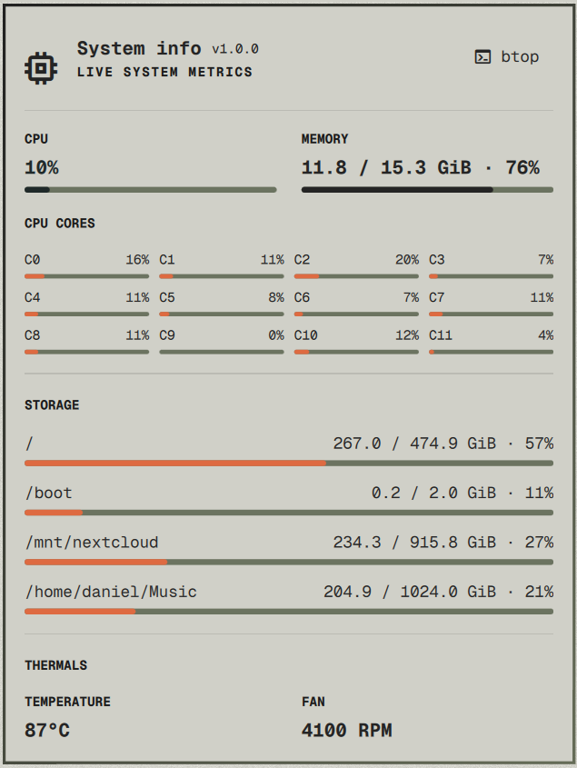

# Omarchy System Info

A third-party Omarchy Shell bar widget that keeps the bar compact: CPU percentage stays visible, while the full system dashboard opens on click. Hover for a short summary. The dashboard includes a button to open or focus `btop`.



Tested on Omarchy `4.0.4-1`.

## Features

- Bar: aggregate CPU percentage, with warning and critical colors at 60% and 85%.
- Hover summary: CPU, RAM, root filesystem usage, temperature, and fan speed.
- Click panel: aggregate and per-core CPU, RAM, every unique mounted filesystem, temperature, and fan speed.
- Storage includes local and network/FUSE filesystems, excludes pseudo-filesystems, and deduplicates mounts backed by the same source (including Btrfs subvolumes). A volume whose usage cannot be queried remains listed as unavailable.
- Metrics refresh every three seconds. Storage queries share a one-second budget; each individual query has a one-second timeout.
- Missing sensor data is shown as unavailable rather than as zero. A readable zero-RPM reading remains `0 RPM`.

## Requirements

- Omarchy Shell 4 with third-party plugin support.
- Bash, `awk`, `findmnt` (util-linux), `df` and `timeout` (coreutils), plus standard `/proc` and `/sys` filesystems. These are present on a standard Omarchy installation.
- `btop` is optional; it is used only by the panel's launch button.

Temperature currently uses a readable `coretemp` hwmon sensor. Fan speed currently uses the ThinkPad `fan1_input` or `fan2_input` hwmon sensor. Other hardware may report these values as unavailable.

## Install

Review the source before installing. Omarchy plugins run unsandboxed inside the long-lived shell process.

```bash
omarchy plugin add https://github.com/danielmrdev/omarchy-sysinfo.git --enable
```

The widget defaults to the right side of the bar. To enable an already-installed copy:

```bash
omarchy plugin enable danielmrdev.sysinfo --section right
```

Update or remove it with:

```bash
omarchy plugin update danielmrdev.sysinfo
omarchy plugin remove danielmrdev.sysinfo
```

## Data and permissions

The collector reads `/proc`, `/sys`, mount metadata, and filesystem usage. `df` may access an already-mounted network or FUSE filesystem while querying its usage; these calls are bounded by timeouts. The plugin makes no direct API calls and requests no elevated privileges. The `btop` helper runs only when its button is clicked.

## Development

The test suite uses Python 3. From the repository root:

```bash
omarchy plugin validate .
find . -type f -name '*.qml' -print0 | xargs -0 qmllint -I "$OMARCHY_PATH/shell"
bash -n sysinfo.sh tests/test_sysinfo.sh
./tests/test_sysinfo.sh
./sysinfo.sh | python3 -m json.tool
```

See [CHANGELOG.md](CHANGELOG.md) for release history. This project is licensed under MIT; see [LICENSE](LICENSE).
